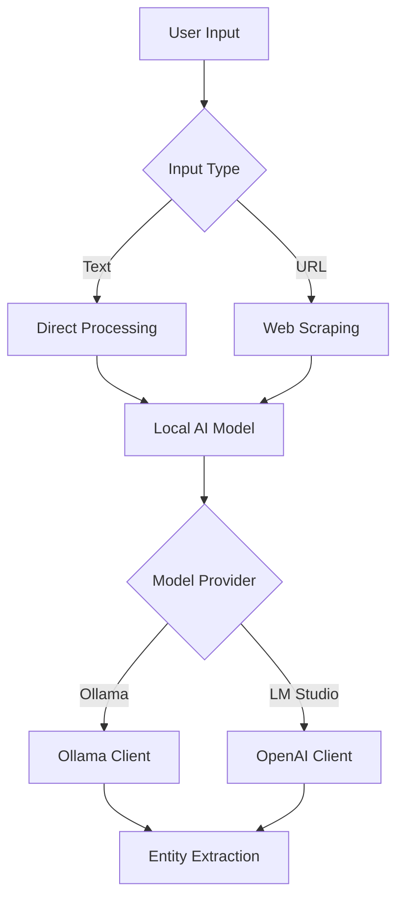
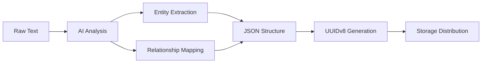
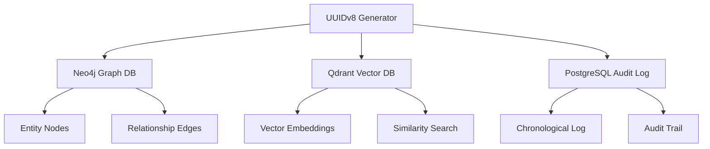

# KGB-MCP Architecture Documentation

## Project Overview

**KGB-MCP** (Knowledge Graph Builder - Model Context Protocol) is an enhanced AI-powered knowledge graph extraction system that transforms text and web content into structured knowledge graphs using local AI models and distributed storage.

**Project UUID**: `kgb-mcp-2025-01-11-arch-doc`
**Version**: 2.0 (Enhanced Integration)
**Date**: January 11, 2025

## System Architecture

### Core Components

#### 1. Input Processing Layer
- **Text Input**: Direct text analysis
- **URL Input**: Web scraping with BeautifulSoup
- **Content Limits**: 5000 chars (URL), 3000 chars (AI analysis)

#### 2. AI Model Integration Layer


**Supported Providers**:
- **Ollama**: Native ollama-python client
- **LM Studio**: OpenAI-compatible API client
- **Custom URLs**: Support for dedicated inference servers

#### 3. Knowledge Graph Processing


**Entity Types**: PERSON, ORGANIZATION, LOCATION, CONCEPT, EVENT, OTHER
**Relationship Types**: Dynamic extraction based on content

#### 4. Unified Storage Layer (hKG)


### UUIDv8 Generation System

**Purpose**: Unified entity tracking across all storage systems
**Format**: `xxxxxxxx-xxxx-8xxx-xxxx-xxxxxxxxxxxx`

**Components**:
- Timestamp (milliseconds)
- Namespace hash ("kgb-mcp")
- Random entropy
- Version bits (8)
- Variant bits (RFC 4122)

```python
def generate_uuidv8(namespace: str = "kgb-mcp") -> str:
    timestamp = int(time.time() * 1000)
    hash_input = f"{namespace}-{timestamp}-{os.urandom(16).hex()}"
    hash_bytes = hashlib.sha256(hash_input.encode()).digest()[:16]
    # Set version and variant bits
    hash_bytes[6] = (hash_bytes[6] & 0x0f) | 0x80  # Version 8
    hash_bytes[8] = (hash_bytes[8] & 0x3f) | 0x80  # Variant bits
    return formatted_uuid
```

## Data Flow Architecture

### 1. Ingestion Pipeline
```
User Input → Content Processing → AI Analysis → Knowledge Graph → Storage Distribution
```

### 2. Storage Strategy
```
Single UUIDv8 → {
    Neo4j: Graph structure (entities + relationships)
    Qdrant: Vector embeddings (semantic search)
    PostgreSQL: Audit logs (chronological tracking)
}
```

### 3. Output Format
```json
{
    "source": {
        "type": "text|url",
        "value": "input_value",
        "content_preview": "First 200 chars..."
    },
    "knowledge_graph": {
        "entities": [...],
        "relationships": [...],
        "entity_count": N,
        "relationship_count": M
    },
    "metadata": {
        "model": "provider:model_name",
        "content_length": N,
        "uuid": "generated-uuid-v8",
        "neo4j_stored": boolean,
        "qdrant_stored": boolean,
        "timestamp": "ISO_datetime"
    }
}
```

## Component Dependencies

### Core Dependencies
```yaml
Runtime:
  - gradio: ">=5.0.0"           # Web interface
  - requests: ">=2.31.0"        # HTTP client
  - beautifulsoup4: ">=4.12.0"  # HTML parsing
  - ollama: ">=0.2.0"           # Ollama client
  - openai: ">=1.0.0"           # OpenAI/LM Studio client

Optional:
  - networkx: ">=3.1"           # Graph analysis
  - matplotlib: ">=3.7.0"      # Visualization
  - numpy: ">=1.24.0"           # Numerical operations
```

### MCP Integration
```yaml
Neo4j_MCP:
  - mcp__neo4j__create_entities
  - mcp__neo4j__create_relations
  - mcp__neo4j__add_observations

Qdrant_MCP:
  - mcp__qdrant__qdrant_store
  - mcp__qdrant__qdrant_find

PostgreSQL_MCP:
  - mcp__postgres__log_audit_entry
  - mcp__postgres__query_audit_logs
```

## Configuration Matrix

### Environment Variables
| Variable | Default | Purpose |
|----------|---------|---------|
| `MODEL_PROVIDER` | `ollama` | AI model provider selection |
| `LOCAL_MODEL` | `llama3.2:latest` | Model identifier |
| `OLLAMA_BASE_URL` | `http://localhost:11434` | Ollama server endpoint |
| `LMSTUDIO_BASE_URL` | `http://localhost:1234` | LM Studio server endpoint |

### Model Provider Matrix
```yaml
Ollama:
  protocol: native_python_client
  authentication: none
  models: [llama3.2, mistral, codellama, ...]
  advantages: [native_integration, offline_capability]

LM_Studio:
  protocol: openai_compatible_api
  authentication: api_key_optional
  models: [any_gguf_model]
  advantages: [gui_management, model_flexibility]
```

## Storage Schema

### Neo4j Graph Schema
```cypher
// Entity Node
CREATE (e:Entity {
    name: "entity_name",
    type: "PERSON|ORGANIZATION|LOCATION|CONCEPT|EVENT|OTHER",
    uuid: "generated-uuid-v8",
    description: "entity_description",
    extracted_at: "ISO_datetime"
})

// Relationship Edge
CREATE (e1)-[:RELATIONSHIP_TYPE {
    uuid: "same-uuid-v8",
    description: "relationship_description",
    extracted_at: "ISO_datetime"
}]->(e2)
```

### Qdrant Vector Schema
```json
{
    "vector": [0.1, 0.2, ...],  // AI-generated embeddings
    "payload": {
        "uuid": "generated-uuid-v8",
        "content": "full_text_summary",
        "entities": ["entity1", "entity2"],
        "relationships": ["rel1", "rel2"],
        "entity_count": N,
        "relationship_count": M,
        "timestamp": "ISO_datetime"
    }
}
```

### PostgreSQL Audit Schema
```sql
CREATE TABLE audit_logs (
    id SERIAL PRIMARY KEY,
    uuid VARCHAR(36),
    user_id VARCHAR(255),
    action VARCHAR(100),
    content TEXT,
    metadata JSONB,
    timestamp TIMESTAMP DEFAULT NOW()
);
```

## Performance Characteristics

### Processing Limits
- **URL Content**: 5,000 characters max
- **AI Analysis**: 3,000 characters max
- **Preview Display**: 200 characters max
- **Entity Extraction**: No hard limit (model dependent)

### Scalability Considerations
```yaml
Bottlenecks:
  - AI model inference time
  - Network latency to model servers
  - MCP server response times

Optimizations:
  - Local model deployment
  - Dedicated inference servers
  - Async storage operations
  - Batch processing capability
```

## Error Handling Strategy

### Graceful Degradation
```python
Model_Server_Down → Fallback_to_Mock_Data
MCP_Server_Down → Local_Storage_Only
Network_Error → Cached_Response
Parse_Error → Structured_Error_Response
```

### Error Response Format
```json
{
    "error": "descriptive_error_message",
    "knowledge_graph": null,
    "extraction_error": "detailed_llm_error",
    "raw_response": "model_output_if_available"
}
```

## Security Considerations

### Data Privacy
- No external API calls (all local processing)
- Content limited to prevent token exhaustion
- No persistent storage of raw input content
- UUID generation without personal identifiers

### Network Security
- Configurable local-only endpoints
- No internet requirements for core functionality
- MCP server communication over secure channels

## Testing Strategy

### Unit Tests
```python
test_uuidv8_generation()      # UUID format validation
test_model_availability()     # Local model connectivity
test_entity_extraction()      # AI processing pipeline
test_json_structure()         # Output format compliance
test_mcp_integration()        # Storage system connectivity
```

### Integration Tests
```python
test_end_to_end_pipeline()    # Full workflow validation
test_storage_consistency()    # Cross-database UUID tracking
test_error_scenarios()        # Failure mode handling
test_performance_limits()     # Load and capacity testing
```

## Migration Path

### From Original Version
1. **Environment Setup**: Configure local model servers
2. **Dependency Update**: Install new requirements
3. **Configuration**: Set MODEL_PROVIDER and endpoints
4. **Testing**: Verify model connectivity
5. **Deployment**: Drop-in replacement ready

### Backward Compatibility
- Original JSON structure maintained
- Enhanced metadata with new fields
- Graceful handling of missing components
- No breaking changes to existing integrations

## Future Roadmap

### Phase 1 Enhancements
- GraphQL API for knowledge graph queries
- Batch processing capabilities
- Enhanced vector embedding options
- Model-specific prompt optimization

### Phase 2 Scaling
- Distributed processing support
- Real-time streaming capabilities
- Advanced similarity search features
- Multi-language model support

### Phase 3 Intelligence
- Active learning feedback loops
- Automated model fine-tuning
- Intelligent entity disambiguation
- Cross-domain knowledge linking

## Monitoring and Observability

### Key Metrics
```yaml
Performance:
  - Model inference latency
  - Storage operation timing
  - End-to-end processing time
  - Error rates by component

Usage:
  - Requests per minute
  - Entity extraction accuracy
  - Storage success rates
  - Model utilization

Health:
  - Model server availability
  - MCP server connectivity
  - Storage system status
  - Memory and CPU usage
```

### Logging Strategy
```python
Levels:
  DEBUG: Model responses, storage operations
  INFO: Processing progress, system status
  WARN: Fallback activations, partial failures
  ERROR: Critical failures, system unavailability
```

This architecture documentation provides a comprehensive view of the enhanced KGB-MCP system, covering all aspects from high-level design to implementation details.